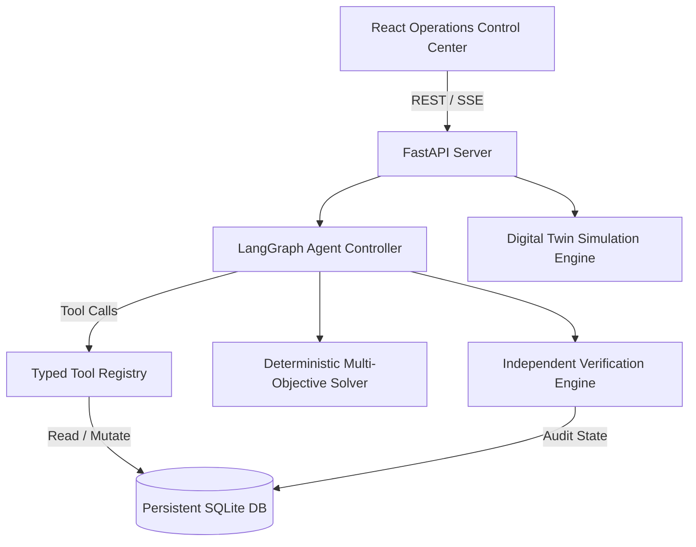

# System Architecture - NIRVAHA

NIRVAHA is an autonomous, stateful supply-chain recovery engine designed for continuous monitoring, disruption detection, multi-objective optimization, state-mutating execution, automated verification, and autonomous replanning.

---

## High-Level Architecture Diagram

---

## Core Components

### 1. Persistent Digital Twin (`backend/models/domain.py` & `backend/simulation/`)
- Relational schema modeling Indian logistics entities:
  - **Suppliers** (Chennai, Bengaluru, Pune, Hyderabad)
  - **Warehouses / Hubs** (Hyderabad Central, Mumbai Western, NCR Northern)
  - **Retail Stores** (Delhi Superstore, Kolkata Hub, Ahmedabad, Bengaluru Tech Park)
  - **Routes & Shipments** (Distance, Travel Time, Transport Cost, Carbon Factors, Status)
  - **Inventories, Purchase Orders, Demands, Disruptions, Agent Traces, Plan Versions**

### 2. Multi-LLM Provider Engine (`backend/agent/llm_provider.py`)
- Configurable host LLMs:
  1. Local Ollama (`http://localhost:11434`)
  2. Google Gemini API (`gemini-2.5-flash`)
  3. Groq API (`llama-3.3-70b-versatile`)
- Includes fallback logic ensuring continuous operations even if LLM host is offline.

### 3. Deterministic Recovery Solver (`backend/optimizer/recovery_solver.py`)
- Formulates multi-objective recovery scoring:
  $$\text{Score} = w_{\text{cost}} \cdot \text{Cost}_{\text{norm}} + w_{\text{delay}} \cdot \text{Delay}_{\text{norm}} + w_{\text{carbon}} \cdot \text{Carbon}_{\text{norm}} + w_{\text{sla}} \cdot (1 - \text{SLA}) + w_{\text{risk}} \cdot \text{Risk}$$
- Evaluates hard constraints (supplier capacity, route throughput, warehouse storage limits, MOQ, SLA deadlines).

### 4. Independent Verification Engine (`backend/verification/engine.py`)
- Does not trust tool execution return strings blindly.
- Re-queries persistent SQLite database after action execution to verify physical inventory movement, PO creation, and constraint compliance.
- Invalidates active plans if new disruptions break feasibility during execution.

### 5. Disruption Injection Engine (`backend/simulation/disruptions.py`)
- Injects real state-mutating failures:
  - SupplierShutdown
  - CapacityReduction (50% drop)
  - RouteClosure (Highway flooding)
  - DemandSpike (2x surge)
